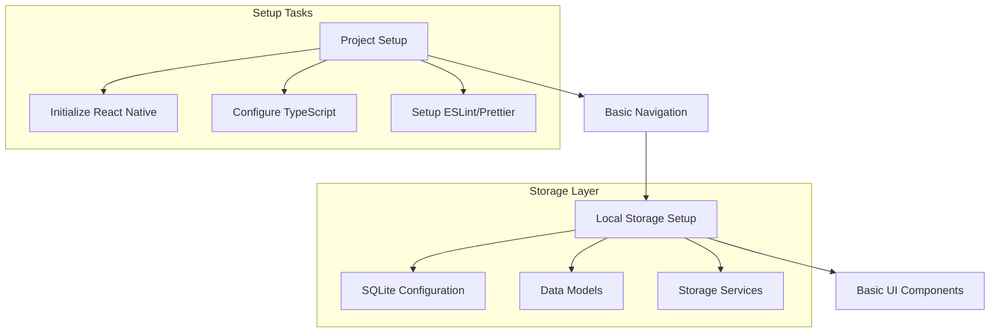
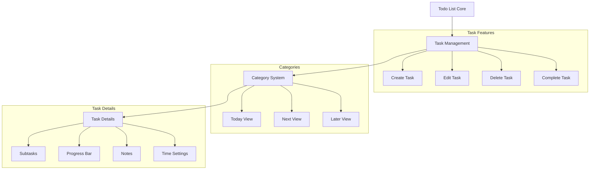
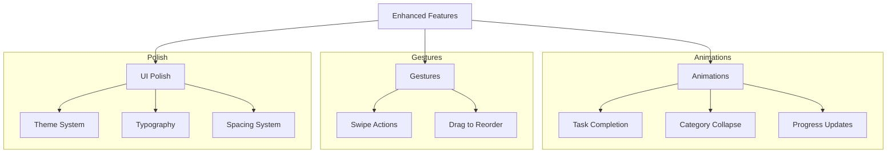
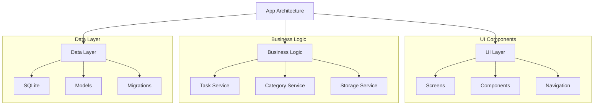

# Forge Implementation Plan

## Overview

This document outlines the implementation plan for the Forge application, focusing initially on the Todo List functionality as the core feature. The plan is structured in phases to ensure systematic development and testing.

## Phase 1: Project Setup and Basic Infrastructure



### 1. Project Initialization

- Create React Native project with TypeScript
- Set up navigation (React Navigation)
- Configure ESLint and Prettier
- Set up project structure

### 2. Data Layer Setup

- Configure SQLite for local storage
- Create data models for:
  - Tasks (id, title, description, status, priority, created_at, updated_at)
  - Subtasks (id, parent_id, title, status)
  - Categories (Today, Next, Later)

## Phase 2: Todo List Core Features



### 1. Basic Task Management

- Task list view with categories (Today, Next, Later)
- Task creation/editing/deletion
- Task completion with checkmark
- Task priority system

### 2. Task Details Implementation

- Subtask management
- Progress bar based on subtask completion
- Notes section
- Time allocation settings

### 3. UI Components

- Custom TaskCard component
- Category headers with collapsible sections
- Progress indicators
- Custom input forms

## Phase 3: Enhanced Features and Polish



### 1. Gesture Integration

- Swipe right for timer (placeholder for future timer integration)
- Task reordering within categories
- Smooth category collapse/expand

### 2. Visual Polish

- Implement black base theme
- Add orange highlights for North Star tasks
- Add grey styling for regular tasks
- Custom fonts and typography system

### 3. Performance Optimization

- List virtualization for smooth scrolling
- Efficient SQLite queries
- Memoization of heavy components

## Technical Specifications



### Key Technologies

- React Native
- TypeScript
- SQLite for local storage
- React Navigation
- Reanimated for animations
- React Native Gesture Handler

### Project Structure

```
src/
├── components/
│   ├── task/
│   ├── category/
│   └── common/
├── screens/
│   ├── TodoList/
│   └── TaskDetails/
├── services/
│   ├── storage/
│   └── task/
├── models/
├── hooks/
├── utils/
└── theme/
```
